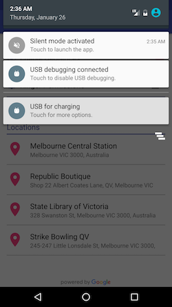

# ShushMe
Google Places API demo app

Features:
 - allow users to add a specific location into the app database
 - check if the users are entering the save location or not by using geofences
 - if yes, the app will turn into the silent mode
 - if no, the app will turn the app into normal mode
 
*the app is quite useful to automatically turn your phone silent mode when entering locations such as meeting, university lecture, cinema,...

## Screenshots

  
  
